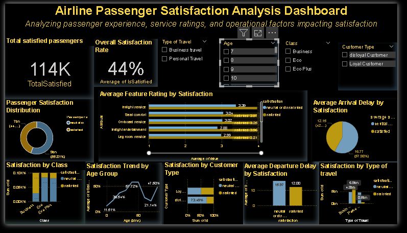

# ✈ Airline Passenger Satisfaction Dashboard

## 📊 Project Overview
This project analyzes airline passenger satisfaction data to understand key factors influencing the customer experience and overall satisfaction levels.  
Using Power BI, we visualized passenger demographics, service ratings, and operational performance metrics (such as delays) to identify trends and patterns that can help airlines improve service quality.

---

## 🧭 Objectives
- Analyze the **distribution of passenger satisfaction** across different demographics and travel types.  
- Evaluate the **impact of service features** (e.g., seat comfort, Wi-Fi, onboard service) on satisfaction levels.  
- Assess how **operational delays** (departure and arrival) correlate with passenger satisfaction.  
- Build an **interactive dashboard** to explore key insights and trends.

---

## 🧰 Tools & Technologies
- 📈 **Power BI** — Data modeling, visualization, and dashboarding.  
- 🧮 **Power Query** — Data transformation and cleaning.  
- 🗂 **Dataset** — Airline Passenger Satisfaction dataset (publicly available).  
- 🖼 **Screenshots** — For documentation and GitHub preview.  
- 💻 **GitHub** — Version control and portfolio hosting.

---

## 🧾 Dataset Information
The dataset includes passenger-level information such as:
- Demographics (Age, Gender, Customer Type)
- Travel details (Class, Type of Travel, Flight Distance)
- Service ratings (Wi-Fi, Seat comfort, Online boarding, etc.)
- Operational delays (Departure & Arrival delay in minutes)
- Overall satisfaction labels (Satisfied / Dissatisfied)

📌 *Data source: Airline Passenger Satisfaction dataset (e.g., Kaggle).*

---

## 📊 Dashboard Features

| Feature | Description |
|---------|-------------|
| 🪄 **KPI Cards** | Show total number of satisfied passengers and overall satisfaction rate. |
| 📈 **Line Chart** | Satisfaction trend by passenger age group. |
| 🥧 **Pie & Donut Charts** | Satisfaction distribution by travel type and customer type. |
| 📊 **Bar Charts** | Satisfaction by service features, travel class, and delay analysis. |
| 🧭 **Slicers** | Interactive filtering by travel type, customer type, and class. |

---

## 🪙 Key Insights
- ✅ Only **44% of passengers** reported being satisfied.  
- 🪑 **Business class passengers** have the highest satisfaction rate.  
- ⏳ Longer delays are associated with **lower satisfaction**.  
- 💻 Features such as Wi-Fi, seat comfort, and onboard service have the **strongest influence** on satisfaction.

---

## 🖼 Dashboard Screenshots

| Overall Dashboard |
|-------------------|
|  |

*(Add more screenshots if you want to show specific sections — e.g., slicers, delay analysis, or satisfaction trend.)*

---

## 🚀 How to Use
1. Clone or download this repository.  
2. Open `Airline_Satisfaction_Dashboard.pbix` in Power BI Desktop.  
3. Use the slicers to filter and explore:
   - Type of Travel
   - Customer Type
   - Travel Class
4. Analyze insights through interactive charts and KPIs.

---

## 🧑‍💻 Author
**Puja Khadka**  
📬 [LinkedIn](#) *(optional)*  
🖥 [GitHub](https://github.com/poozakhadka33)

---

## 📝 License
This project is for **educational and portfolio purposes** only.  
Dataset sourced from a **public domain** (e.g., Kaggle). Not intended for commercial use.

---

⭐ *If you like this project, consider giving the repository a star to support my work!*
